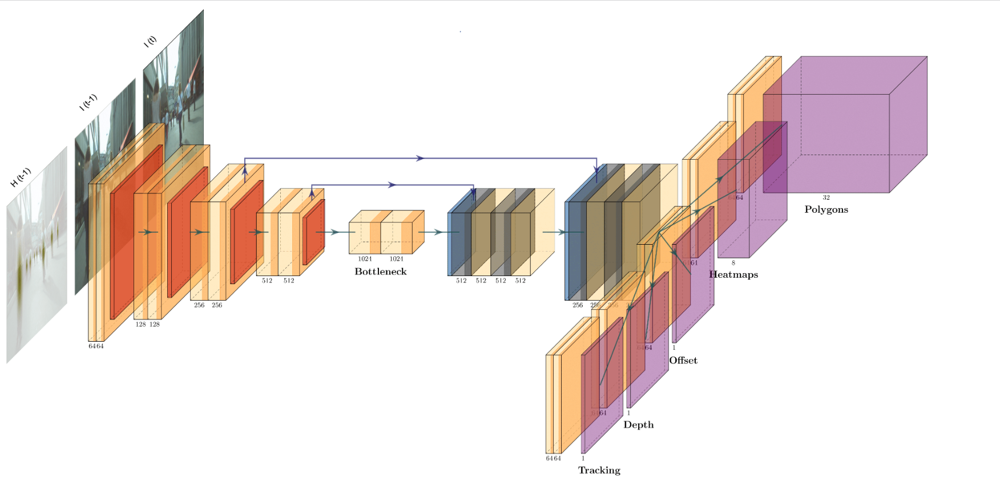
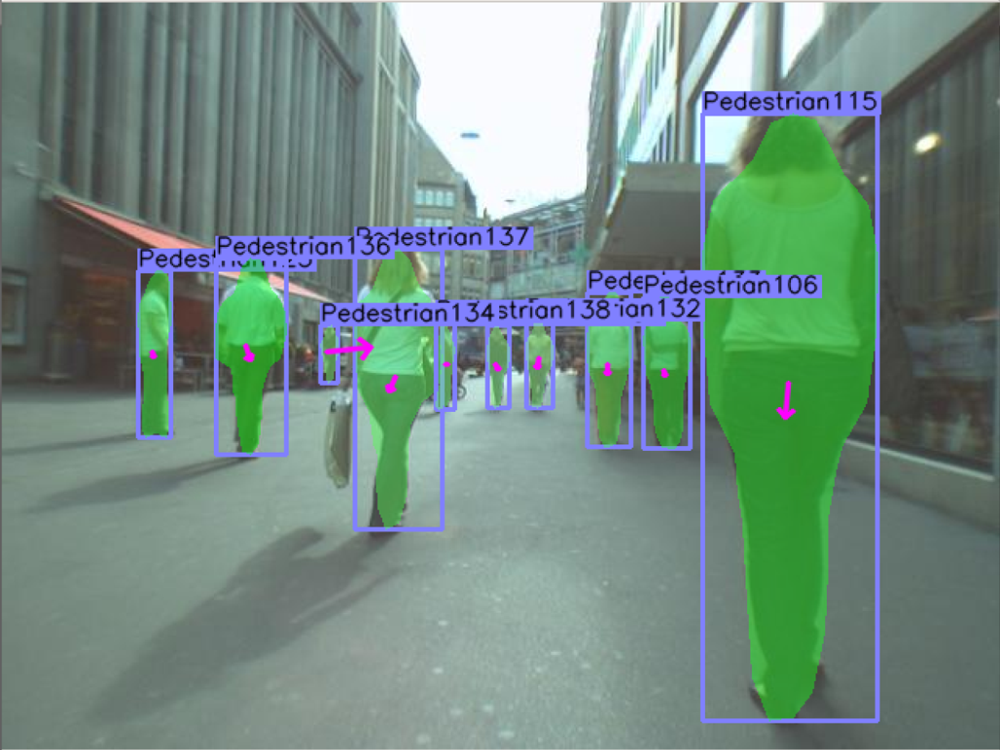

# PolyTrack: Tracking with Bounding Polygons

Paper available at: https://arxiv.org/abs/2111.01606

## Abstract
In this paper, we present a novel method called PolyTrack for fast multi-object tracking and segmentation using bounding polygons. Polytrack detects objects by producing heatmaps of their center keypoint. For each of them, a rough segmentation is done by computing a bounding polygon over each instance instead of the traditional bounding box. Tracking is done by taking two consecutive frames as input and computing a center offset for each object detected in the first frame to predict their location in the second frame. A Kalman filter is also applied to reduce the number of ID switches. Since our target application is automated driving systems, we apply our method on urban environment videos. We train and evaluate PolyTrack on the MOTS and KITTIMOTS dataset.

## Example results

Video examples from the [KITTI MOTS](http://www.cvlibs.net/datasets/kitti/eval_mots.php) test set:

  
 

  
 

## Model

An overview of the PolyTrack architecture. The network takes as input the image at time t, I(t), the image at time t-1, I(t-1), as well as the heatmap at time t-1, H(t-1). Features are produced by the backbone and then used by five different network heads. The center heatmaps head is used for detecting and classifying objects, the polygon head is used for the segmentation part, the depth head is used to produce a relative depth between objects, the tracking head is used to produce an offset between frames at time t-1 and time t and finally the offset head is used for correctly upsampling images.

a) Generated Heatmap       | b) Generated Output
:-------------------------:|:-------------------------:
 | 

a): The center heatmap produced by the network to detect objects, b): the output of our method: a bounding polygon for each object, a class label, a track id as well as an offset from the previous frame.

## Installation

Please refer to [INSTALL.md](readme/INSTALL.md) for installation instructions.

## Folder organization
- /experiments: bash files to start repeat our experiments, you can also find an example of how to perform a demo.
- /src/lib    : contains the code needed to generate and train a model
- /src/tools  : contains tools relevant to different datasets, you can find the files we used to generate our ground truth here.
- /data       : not included in the git repo, but contains images from the dataset with the following structure:
- /data/MOTS/test/  : contains test images
- /data/MOTS/train/ : contains train images
- /data/MOTS/seqmaps/    : contains seqmaps
- /data/MOTS/json_gt/    : contains ground truth files generated by our tools

## License

PolyTrack is released under the MIT License. PolyTrack is based upon [CenterTrack](https://github.com/xingyizhou/CenterTrack) and [CenterPoly](https://github.com/hu64/CenterPoly). Portions of the code are borrowed from [CornerNet](https://github.com/princeton-vl/CornerNet) (hourglassnet, loss functions), [dla](https://github.com/ucbdrive/dla) (DLA network) and [DCNv2](https://github.com/CharlesShang/DCNv2)(deformable convolutions). Please refer to the original License of these projects (See [NOTICE](NOTICE)).
